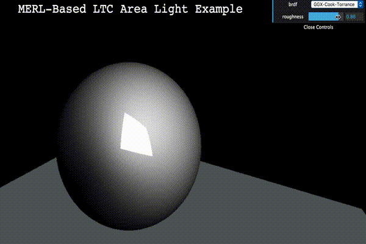

Linearly Transformed Cosines Visualizer
================================================

This is a THREE.js implementation and visualization tool for real time area lights algorithm found in the LTC paper.

MERL BRDFs
----------

Beyond implementing real-time area lights, this extends the distributions available to include MERL tabulated BRDFs. 
Generated MERL BRDF LUTs can be made with [this](https://github.com/romanlarionov/LTC_Fitting/tree/merl) fitting code. 

Transformation Viewer
--------------------

Visualization of the polygonal light prior to and during transformation. A static clamped cosine lobe is used to visualize D_0 being `(1/pi) * max(cos(theta), 0)`. The area light projection can also be seen transforming with the polygon. 

Varying the theta or roughness value will show how the polygon warps to compensate for the irradiance it should be emitting.

